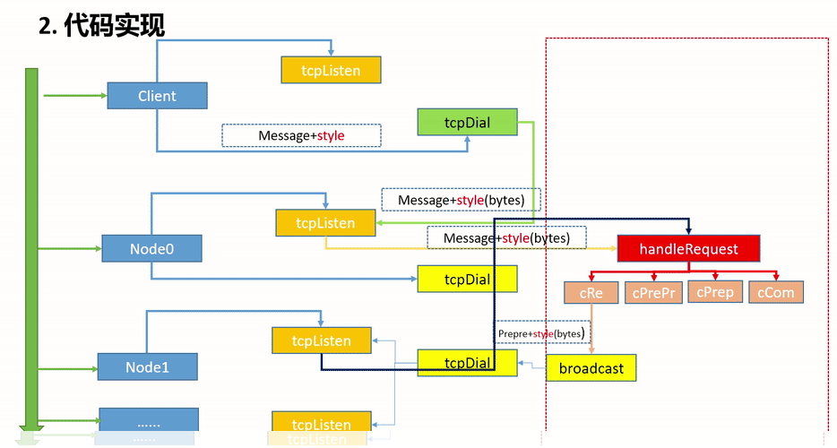

## 共识算法

### PoW 工作量证明机制

最早（也是第一个）被应用的共识机制，最先被比特币采用并且获取了巨大成功，它支撑了比特币系统长达 10 多年无重大故障使其平稳运行。而且 PoW 构想也符合特币创始人中本聪最初的设想：人人皆可挖矿、按劳分配、公平公正。

PoW 属于按劳分配，多劳多得，就如同大家在比特币系统中一起进行数学运算，最先运算出的才能获得奖励。进行运算获得奖励的过程称之为挖矿，参与挖矿的人们称之为矿工。

**代表币种：**BTC、BCH、LTC等。

**PoW 机制的优点：**

* 公平公正：去中心化程度高，人人都可以参与获得记账权；
* 安全系数高：全网算力越高，其安全程度也越高，如破坏该系统需要投入巨大成本；

**PoW 机制的缺点：**

* 资源浪费、效率低下：因每一笔交易都需要通过多数矿工的确认，在这些矿工进行运算的过程中**消耗大量的电力资源等。**
  > 之前看过肖老师的课程，他认为数字货币挖矿是节能的，因为很多地方比如说西北那边电力很多，而电力运输的话会消耗大量的电力，但是如果是挖矿，就能有效地将电能可利用话，算是节约资源，对此我保持中立。
  >
* 算力集中：根据往年数据显示，在资本大量进入的情况下，过去一年矿池算力份额排名前五位的矿池占据了比特币总算力份额的 65%，马太效应逐渐显现，而算力过度集中还存在着 51% 攻击的风险。

有问题，自然而然就有解决，如当前网络中HTTP协议存在的问题，IPFS 就诞生，同理各种各样的共识机制开始走上了台面，其中最有力的挑战者自然就是 PoS 了。

---

### PoS 权益证明机制

因 PoW 存在的问题，PoS 在主流算法一路畅通的“杀了出来”，成为了最具有挑战者。近几年，基于 PoS 共识打造的区块链项目越来越多，如目前市值保持第二的以太坊也加入了 PoS。

在 PoS 机制中，是不需要消耗电力来进行运算，而是通过抵押 token 来获得打包区块的权利。当一笔交易发生时，系统会对打包区块和验证区块的节点来进行奖励，奖励则是增发或者解锁的 token。

**代表币种：**ADA、ONT、ATOM等。

**PoS 机制的优点：**

* 不浪费资源、效率高：因其不需要拼算力挖矿，同时缩短了共识达成的时间，转账效率提高了；
* 弱化了中心矿池规模经济的需求：算力集中垄断的情形也得到了缓解，个体竞争力差别相对减小；

**PoS机制的缺点：**

* 被动形成中心化：因去中心化程度，容易出现强者恒强的情况，会导致富者越富，资源越来越集中的情况。
* 安全隐患：PoS机制实现较为复杂，容易产生安全漏洞。
* 无权益问题（Nothing at Stake）：用户在PoS中可以同时在两个分叉上面下注；无论哪一个分叉后面被公认为主链，该用户都可以获得奖励而没有机会成本的损失。这样也在事实上会干扰共识的形成。

---

### DPoS 委托权益证明机制

DPoS 机制是在 PoS 的基础上进行了改良，举例来说就是大家公认的投出选票，选举出一定数量的代表，让这些代表进行验证和记账等，可以理解为 PoS 的升级版。

**代表币种：**EOS、TRX等。

**DPoS机制的优点：**

* 比 PoS 机制拥有更高的效率和性能：相比于 PoS 机制，DPoS 大幅缩小了参与验证和记账的节点数量。

**DPoS机制的缺点:**

* 去中心化程度低：相比较于只能说是弱中心化；
* 安全问题严重：类 PoS 机制的通病，相信大家都看到过报道，如被黑客攻击等等。

---

### PoC 容量证明机制

PoC 机制早在 2014 年存在了，但只是一直处于“落魄阶段”，简单说就是没火，无人问津。PoC 机制是通过普通硬盘挖矿的共识机制。简单来说就是利用计算机硬盘中的闲置空间来进行存储进行挖矿获取收益，硬盘空间越大，存储的内容越多获得的收益就越大。

IPFS 也类似，但不同的是 IPFS 衍生的区块链项目（激励层Filecoin）是一种去中心化存储服务的 Marketplace（撮合交易的市场），它的重点在于如何在系统参与者互不信任的条件下，实现存储和检索工作的量化；PoC 是一种底层共识机制，与 PoW、PoS一样都是去中心化网络达成一致性状态的算法。由此来看，两者是完全不同的概念，唯一的共同点就是都可以使用硬盘向网络贡献价值来换取收益。

**代表币种：**BTT、BHD等。

**POC的优点：**

* 挖矿门槛较低
* 去中心化程度较高，能源消耗较小

**POC的缺点：**

* 未来发展的局限性可能较大，可能会有政策性风险。
* PoC并没有实现真正的平等

### PBFT

需要知道，PBFT算法的实现并不是听起来那么简单，我们通常听的这个算法的实现的的最为主要的，只是这种算法中的一个协议-----一致性协议。

#### 局限性

但是正如前面提到的那样，大多数的人更加在乎的也是论文中主要讲述的大多是第一个阶段也就是第一个协议：一致性协议。这也不怪，毕竟，这是大家普遍认为重要的点。但是相反，如果加以改进的将是其他的两个阶段。

#### 一致性协议

### 其他共识

以上就是常见的共识机制和具有代表的币种，并不能完全代表现有区块链行业，如联盟链常用的 PBFT，新经币（NEM）用的 PoI 等。~关于共识机制结合点为区块链底层技术、金融、计算机、法律~

### 以太坊准备采用的权益证明协议

以太坊中，准备采用的权益证明协议为  **Casper the Friendly Finality Gadget(FFG)** ，该协议在过渡阶段是要和 POW 结合使用的。为工作量证明提供 Finality。

Finality 是一种最终的状态，包含在 Finality 中的交易不会被取消

单纯基于挖矿的交易是有可能被回滚的，比特币中规定要等六个区块来防止被回滚，但这只是说明回滚的概率比较小，但是只要攻击者的算力足够强（占到 50% 以上）仍然可能回滚该交易。所以单纯基于挖矿的区块链是缺乏这种 Finality 的。

Casper 协议引入一个概念：Validator(验证者)，一个用户想要成为 Validator，需要上交一笔 “保证金”，这笔保证金会被系统锁定。Validator 的职责是推动系统达成共识，投票决定哪一条链成为最长合法链，投票权重取决于保证金数目。挖矿的时候每挖出一百个区块就作为一个 epoch，然后通过投票决定其能不能成为一个 Finality。

投票时采用 two-phase commit，第一轮投票是 Prepare Message，第二轮投票时 Commit Message，Casper 规定每一轮投票都要得到 2/3 以上的验证者才能通过（按照保证金的金额大小计算）实际系统中不再区分这两个 Message，而且把 epoch 从 100 个区块减到 50 个区块，且只需要一轮投票（对于上一个 epoch 是 Commit Message，对下一个 epoch 是 Prepare Message），要连续两轮投票都得到 2/3 以上的多数才算有效。

**原始版本：**

**优化后：**

矿工挖矿会获得出块奖励，而验证者也会得到相应奖励。当然，为了防止验证者的不良行为，规定其被发现时要受到处罚。例如某个验证者 “行政不作为”，不参与投票导致系统迟迟无法达成共识，这时会扣掉部分保证金；如果某个验证者 “乱作为”，给两个有冲突的分叉都进行投票（两边下注），被发现后没收全部保证金。**没收的保证金被销毁，从而减少系统中货币总量。**验证者存在 “任期”，在任期结束后，进入 “等待期”，在此期间等待其他节点检举揭发是否存在不良行为进行惩处，若通过等待期，则可以取回保证金和应得的奖励。

**Q：通过验证者达成的 Finality 有没有可能被推翻？** A：如果发动攻击的组织仅仅作为矿工的话是无法推翻的，必须在系统中，存在大量 “验证者” 对前后两个有冲突的 Finality 都下注。也就是说，至少 1/3（该协议规定超过 2/3 才有效）的验证者两侧都投票。而这一旦被发现，这 1/3 验证者的保证金将会被没收。

以太坊系统设想，随着时间推移，挖矿奖励逐渐减少而权益证明奖励逐渐增多，从而实现 POW 到 POS 的过渡，最终实现完全放弃挖矿。

**为什么以太坊不从一开始就用权益证明呢？** 因为权益证明还不是很成熟，工作量证明是很成熟的，经过了时间的检验（bug bounty）。 EOS 加密货币，即 “柚子”，就是采用权益证明的共识机制，其采用的是 DPOS：Delegated Proof of Stake。该协议核心思想是通过投票选 21 个超级节点，再由超级节点产生区块。但目前，权益证明仍然处于探索阶段。
